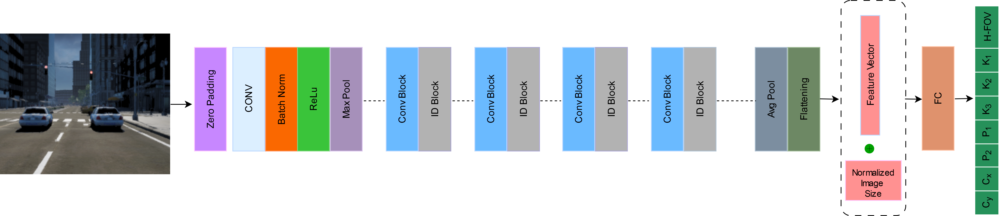
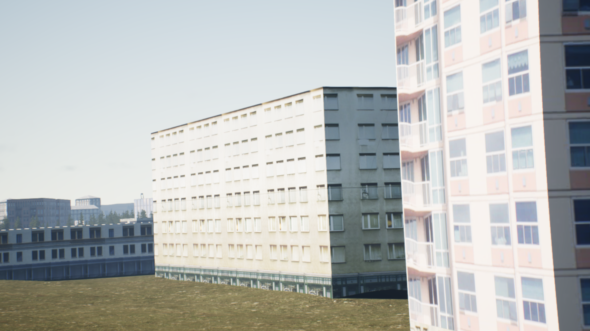
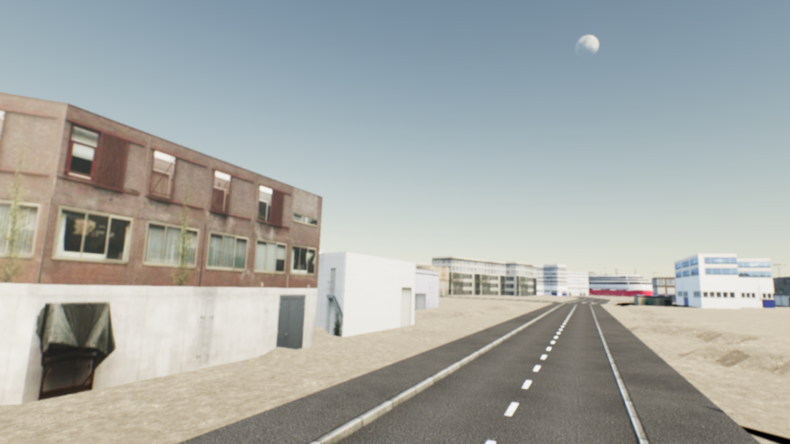
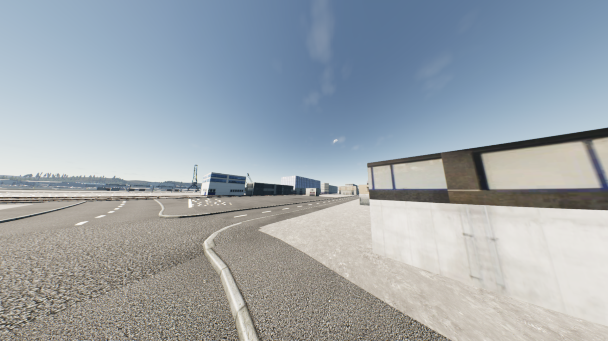

# Deep-BrownConrady (DBC) –  Prediction of Camera Calibration and Distortion Parameters Using Deep Learning and Synthetic Data

[](./LICENSE)
[](
https://arxiv.org/abs/2501.14510)


## Overview

**Deep-BrownConrady (DBC)** is a deep learning-based method to predict camera calibration and lens distortion parameters from a single image using the Brown-Conrady distortion model. The models are trained on a large-scale synthetic dataset generated using the [AILiveSim](https://www.ailivesim.com) platform, and evaluated on both synthetic and real-world datasets like KITTI, MALAGA, and CityScapes.

<p align="center">
  
</p>

## Key Features

- Predicts intrinsic camera parameters:
  - Horizontal Field of View (`H-FOV`)
  - Principal Point (`cx`, `cy`)
  - Distortion Coefficients (`k1`, `k2`, `k3`, `p1`, `p2`)

- Trained on 1.5M+ synthetic images + 10,000 KITTI images
- Generalizes to real-world data
- Supports multiple image resolutions and aspect ratios
- Uses a modified ResNet50 architecture for regression

## Dataset

The Camera Parameter Search (CPS) dataset is used for training and evaluation. It contains:
- Images captured from synthetic urban scenes
- FOVs ranging from 30° to 150°
- Two aspect ratios: `1920x1080` and `1392x512`
- Lens distortions simulated using Brown-Conrady parameters


|  |  |  |
|:---------------------:|:---------------------:|:------------------------:|
| **H-FOV = 29.04°**<br>k1=0.384, k2=0.465, k3=0.076<br>p1=0.0167, p2=0.0326<br>cx=947, cy=523 | **H-FOV = 88.18°**<br>k1=0.0027, k2=-0.0010, k3=0.0010<br>p1=-0.0053, p2=0.0002<br>cx=981, cy=538 | **H-FOV = 147.57°**<br>k1=0.0006, k2=-0.0001, k3=-0.000002<br>p1=-0.0025, p2=-0.0030<br>cx=948, cy=545 |

DeepBrownConrady (DBC) is a deep-learning framework that predicts camera intrinsics and Brown-Conrady distortion coefficients from images.  

It provides two main scripts:

- **`inference.py`** – Run the model, write a CSV of ground-truth vs prediction, and a timing file  
- **`evaluate_predictions.py`** – Compute normalized error metrics (MSE / RMSE / MAE) for H-FOV, norm-cx, norm-cy, and distortion terms

---

## 1. Project Layout

```
DeepBrownConrady/
├── DBC/                # datasets, models, utils
├── conda-env/          # dbc-env.yml, create_conda_env.sh
├── model/              # dbc.pth, optimizer_config.yml
├── data/               # optional sample images and JSONs
├── inference.py
├── evaluate_predictions.py
├── requirements.txt
└── README.md
```

---

## 2. Setup

### Step 1:

```bash
git clone https://github.com/your_username/DeepBrownConrady.git
```

### Step 2:

Follow the steps in [conda/README.md](conda/README.md) to create and activate the conda environment.

### Step 3:

You can pull the DBC model using the command below.

```bash
curl -L -o dbc.pth https://zenodo.org/record/15548819/files/dbc.pth
```

## 3. Running Inference

```bash
python inference.py --folder_path <"path-to-image-folder"> --output_dir <path-to-output-directory>  --model_path <path-to-dbc.pth> --optim_path ./model/optimizer_config.yml --model_type resnet50_extended_features --scaling_factor 0.25 --device cuda
```

Note: --folder_path can be any folder with images that you would like to calibrate.

### Important Flags

| Flag               | Default                      | Explanation                            |
|--------------------|------------------------------|-------------------------------------- |
| `--folder_path (-p)` | **required**                 | Folder with images and matching JSON GT |
| `--output_dir (-o)`  | `results`                    | Directory for CSV + timing files       |
| `--model_path`       | `./model/dbc.pth`            | Pretrained weights                    |
| `--optim_path`       | `./model/optimizer_config.yml` | Normalization constants               |
| `--device`           | auto                         | `cuda` if available                    |
| `--scaling_factor`   | `0.25`                       | Resize factor before inference        |

### Outputs

- `<output_dir>/<Dataset>-predictions.csv`  
- `<output_dir>/<Dataset>-timing.txt`

---

## 4. Evaluating Predictions

```bash
python evaluate_predictions.py     --csv ./results/kitti-predictions.csv     --width 1392     --height 512
```

This will create a file named `kitti_normalized_error_metrics.csv` with MSE, RMSE, and MAE for:  
`hfov`, `norm_cx`, `norm_cy`, `k1`, `k2`, `k3`, `p1`, `p2`.

---

## 5. Sample Outputs

**Timing File (`kitti-timing.txt`):**

```
Dataset: Kitti
Total images: 512
Total inference time: 3.47 s
Average time per image: 0.0062 s
```

**Prediction CSV (`kitti-predictions.csv`, first row):**

```csv
image,fx_gt,fx_pred,fy_gt,fy_pred,cx_gt,cx_pred,cy_gt,cy_pred,k1_gt,k1_pred,k2_gt,k2_pred,k3_gt,k3_pred,p1_gt,p1_pred,p2_gt,p2_pred
Kitti001.png,984.2439,993.113,980.8141,993.113,690.0,686.52,233.1966,233.93,-0.37288,-0.37333,0.20373,0.21593,-0.07234,-0.07699,0.002219,0.003838,0.001384,0.001285
```

**Metric CSV (`kitti_normalized_error_metrics.csv`):**

```csv
parameter,MSE,RMSE,MAE
norm_cx,5.0e-06,0.0023,0.0018
norm_cy,8.0e-06,0.0028,0.0020
hfov,2.4e-05,0.0049,0.0037
k1,9.7e-05,0.0098,0.0079
k2,8.1e-05,0.0090,0.0074
k3,2.8e-05,0.0052,0.0038
p1,2.6e-05,0.0051,0.0031
p2,1.5e-05,0.0038,0.0029
```

---

## 6. License

MIT – see `LICENSE`.

---

## 7. Citation

If you use any ideas from this paper or code from this repository, please consider citing:

```bibtex
@article{chaudhry2025deepbrownconrady,
  title={{Deep-BrownConrady: Prediction of Camera Calibration and Distortion Parameters Using Deep Learning and Synthetic Data}},
  author={Faiz Muhammad Chaudhry and Jarno Ralli and Jerome Leudet and Fahad Sohrab and Farhad Pakdaman and Pierre Corbani and Moncef Gabbouj},
  journal={arXiv preprint arXiv:2501.14510},
  year={2025}
}